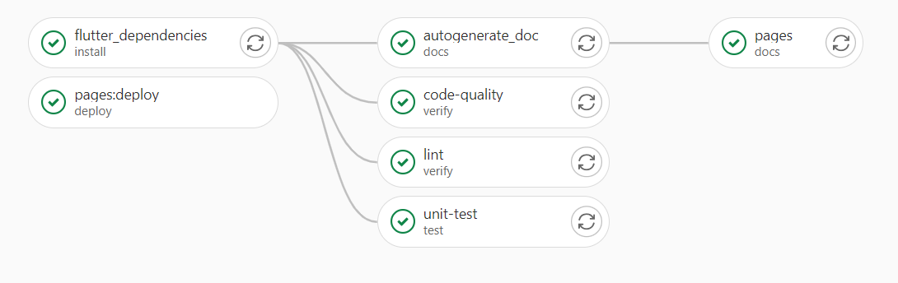

# Welcome

**Japanese vocabulary** is meant to be a mobile app for learning Japanese vocabulary. The user, through the spaced repetition method, can learn, self-evaluate and see the improvements.

You can find the entire repository [here](https://gitlab.com/saiteki-kai/japanese-vocabulary).

## Developers

* Magazzù Gaetano
* Magazzù Giuseppe
* Malanchini Mirco
* Marino Mario
* Pietrasanta Davide

## Demo


<!---  
Alternative pure markdown version.
This doesn't resize the image!


-->

## Architecture


### Data Layer

This layer interacts with the database and other data sources. The data is accessed directly via a repository.

The **repository pattern** decouples the data layer from the business logic layer by hiding access to the data. Since we have only one data source, we don't use DAOs but only repository implementations to avoid excessive abstraction.

### Business Logic Layer

This layer is the core of the application and processes the business logic.

The [**BloC pattern**](https://bloclibrary.dev/#/) decouples the business layer from the presentation layer, allowing changes to the UI to be made without impacting business logic and simplifying business logic testing.

[](https://bloclibrary.dev/#/coreconcepts)

The Bloc receives events via user input and sends a request to the data layer. Then the response is processed and the result is returned by changing the state and rerender the user interface.

### Presentation Layer

This layer displays the interface and gets information from the user. The user interface is presented using Flutter widgets.

## Folder Structure

```text
lib
├── bloc                        # Business logic (BloC pattern)
├── config                      # Routes, themes, ...
├── data                        # Data folder
│   ├─ models                   # Models
│   ├─ repositories             # Repository implementations
│   └─ app_database.dart        # Database instance
├── ui                          # UI folder
│   ├─ screens                  # Screens
│   │  ├─ home                  # Home screen folder 
│   │  │  ├─ widgets            # Widgets used only in the home screen
│   │  │  └─ home_screen.dart   # Home screen widget
│   │  ├─ settings              
│   │  └─ ...
│   └─ widgets                  # Common widgets shared between screens  
├── utils                       # Utility functions  
└── main.dart
```

## Pipelines



## Installation

Install packages

```bash
flutter pub get
```

Code generation

```bash
flutter pub run build_runner build
```

## Tests

Install the library objectbox (see <https://github.com/objectbox/objectbox-dart/issues/280>)

```bash
bash <(curl -s https://raw.githubusercontent.com/objectbox/objectbox-dart/main/install.sh)
```

Unit/Widget test

```bash
flutter test
```

Integration tests

```bash
flutter test integration_test/ 
```

## Generate the documentation

```bash
dart pub global activate dartdoc
export PATH="$PATH":"$HOME/.pub-cache/bin"

dartdoc

dart pub global activate dhttpd
dhttpd --path doc/api
```

Now you can see the documentation at <http://localhost:8080>

## Generate the code quality report

```bash
dart pub global activate dart_code_metrics
export PATH="$PATH":"$HOME/.pub-cache/bin"

metrics lib --reporter=gitlab --exclude={/**.g.dart,/.template.dart,/**.gr.dart} > gl-code-quality-report.json
```

Now you can see the code quality report in the `gl-code-quality-report.json` file

## Run the application

Debug mode:

```bash
flutter run
```

Release mode:

```bash
flutter run --release 
```

## API

You can find the API [here]($CI_PROJECT_DIR/doc/api/index.html).

## Bug Reports

```text
Note: Be sure to have censored any sensitive data before posting, especially in the logs!
```

Gitlab issues is used for tracking bugs and proposing new features. Please consider the following when opening an issue:

* Avoid opening duplicate issues by taking a look at the current open issues
* Provide details on the app version and operating system
* Provide the expected and the actual behavior
* Provide steps to reproduce the issue
* Include complete log tracebacks and error messages
* An optional description to give more context

<!-- ##  Usage -->

<!-- ## License -->
